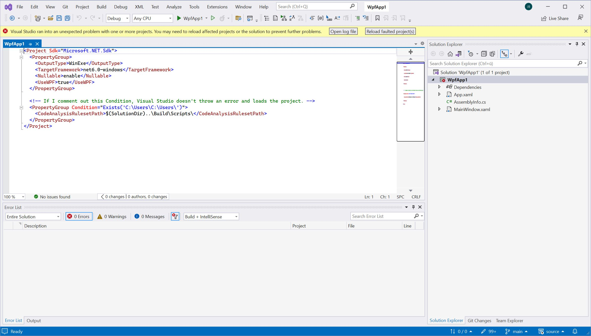

# MVP VS solution for VS 17.5 project loading Bug

[Link to bug in Visual Studio developer community](https://developercommunity.visualstudio.com/t/Visual-Studio-1751-fails-to-load-pro/10299767).

Visual Studio cannot load projects If a PropertyGroup has Condition containing an invalid path: "Visual Studio ran into an unexpected problem with one of more projects. You may need to reload affected projects or the solution to prevent further problems."

However, using msbuild or a pervious version of Visual Studio to build the projects work perfectly fine.

## Sample project
A sample MVP solution with a single project can be found in `sample/Build/WpfApp1.sln` in this repository.

## Screenshot of Visual Studio
 

## Error message:

Extracted from `logs/VsProjectFault_1471b622-04bb-45c1-9570-e802b52c0bd0.failure.txt`

```
=====================
05.03.2023 13:15:04
LimitedFunctionality
System.AggregateException: One or more errors occurred. ---> System.NotSupportedException: The given path's format is not supported.
   at System.Security.Permissions.FileIOPermission.EmulateFileIOPermissionChecks(String fullPath)
   at System.Security.Permissions.FileIOPermission.QuickDemand(FileIOPermissionAccess access, String fullPath, Boolean checkForDuplicates, Boolean needFullPath)
   at Microsoft.VisualStudio.PlatformUI.Packages.FileChange.DefaultFileSystem.PathWrapper.GetFullPath(String path)
   at Microsoft.VisualStudio.Services.FileChangeService.ValidateAndNormalize(String path, String paramName)
   at Microsoft.VisualStudio.Services.FileChangeService.<AdviseFileChangeCoreAsync>d__119.MoveNext()
--- End of stack trace from previous location where exception was thrown ---
   at System.Runtime.ExceptionServices.ExceptionDispatchInfo.Throw()
   at System.Runtime.CompilerServices.TaskAwaiter.HandleNonSuccessAndDebuggerNotification(Task task)
   at Microsoft.VisualStudio.Services.FileChangeService.<RunWithTracingAsync>d__185`2.MoveNext()
--- End of stack trace from previous location where exception was thrown ---
   at System.Runtime.ExceptionServices.ExceptionDispatchInfo.Throw()
   at Microsoft.VisualStudio.ProjectSystem.VS.Implementation.ProjectEvaluationAdditionalDependentFileWatchingService.<CheckContentIrrelevantFileDependenciesStateAsync>d__25.MoveNext()
--- End of stack trace from previous location where exception was thrown ---
   at System.Runtime.ExceptionServices.ExceptionDispatchInfo.Throw()
   at System.Runtime.CompilerServices.TaskAwaiter.HandleNonSuccessAndDebuggerNotification(Task task)
   at Microsoft.VisualStudio.ProjectSystem.VS.Implementation.ProjectEvaluationAdditionalDependentFileWatchingService.<<InitializeCoreAsync>b__19_0>d.MoveNext()
--- End of stack trace from previous location where exception was thrown ---
   at System.Runtime.ExceptionServices.ExceptionDispatchInfo.Throw()
   at Microsoft.VisualStudio.ProjectSystem.DataReceivingBlockSlim`1.<ProcessInputQueueAsync>d__5.MoveNext()
   --- End of inner exception stack trace ---
---> (Inner Exception #0) System.NotSupportedException: The given path's format is not supported.
   at System.Security.Permissions.FileIOPermission.EmulateFileIOPermissionChecks(String fullPath)
   at System.Security.Permissions.FileIOPermission.QuickDemand(FileIOPermissionAccess access, String fullPath, Boolean checkForDuplicates, Boolean needFullPath)
   at Microsoft.VisualStudio.PlatformUI.Packages.FileChange.DefaultFileSystem.PathWrapper.GetFullPath(String path)
   at Microsoft.VisualStudio.Services.FileChangeService.ValidateAndNormalize(String path, String paramName)
   at Microsoft.VisualStudio.Services.FileChangeService.<AdviseFileChangeCoreAsync>d__119.MoveNext()
--- End of stack trace from previous location where exception was thrown ---
   at System.Runtime.ExceptionServices.ExceptionDispatchInfo.Throw()
   at System.Runtime.CompilerServices.TaskAwaiter.HandleNonSuccessAndDebuggerNotification(Task task)
   at Microsoft.VisualStudio.Services.FileChangeService.<RunWithTracingAsync>d__185`2.MoveNext()
--- End of stack trace from previous location where exception was thrown ---
   at System.Runtime.ExceptionServices.ExceptionDispatchInfo.Throw()
   at Microsoft.VisualStudio.ProjectSystem.VS.Implementation.ProjectEvaluationAdditionalDependentFileWatchingService.<CheckContentIrrelevantFileDependenciesStateAsync>d__25.MoveNext()
--- End of stack trace from previous location where exception was thrown ---
   at System.Runtime.ExceptionServices.ExceptionDispatchInfo.Throw()
   at System.Runtime.CompilerServices.TaskAwaiter.HandleNonSuccessAndDebuggerNotification(Task task)
   at Microsoft.VisualStudio.ProjectSystem.VS.Implementation.ProjectEvaluationAdditionalDependentFileWatchingService.<<InitializeCoreAsync>b__19_0>d.MoveNext()
--- End of stack trace from previous location where exception was thrown ---
   at System.Runtime.ExceptionServices.ExceptionDispatchInfo.Throw()
   at Microsoft.VisualStudio.ProjectSystem.DataReceivingBlockSlim`1.<ProcessInputQueueAsync>d__5.MoveNext()<---

===================
```
